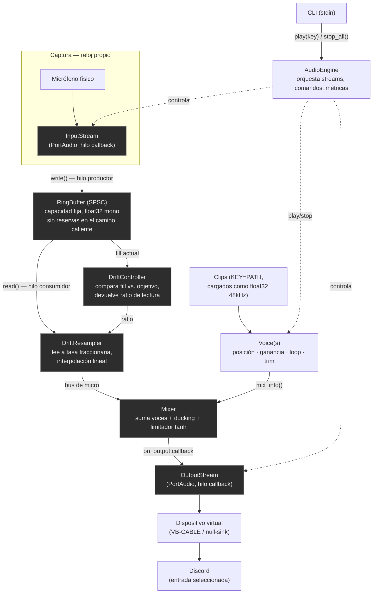

# soundboard

Soundboard multiplataforma que inyecta clips de audio y tu micrófono real,
mezclados, en un dispositivo de entrada virtual — para que Discord (u otra
app de voz) reciba ambos como si vinieran de un único micrófono.

> **Estado:** motor de audio + CLI de verificación, y biblioteca de sonidos
> multiusuario sobre Supabase, implementados. La interfaz gráfica, el
> enrutado automático del dispositivo virtual y la cadena de efectos son
> fases futuras — ver [Roadmap](#roadmap).

## Por qué existe

Discord solo puede escuchar **un** dispositivo de entrada a la vez. Para que
oiga tanto tu voz como los clips que disparas, algo tiene que mezclarlos
*antes* de que lleguen a Discord. Ningún proceso de usuario puede crear un
dispositivo de captura virtual sin un driver de kernel firmado, así que la
aplicación no crea el cable virtual — depende de uno externo (VB-CABLE en
Windows, un módulo null-sink de PipeWire/PulseAudio en Linux) y se limita a:

1. Capturar tu micrófono físico.
2. Sumarle los clips que disparas.
3. Escribir el resultado en el dispositivo virtual que Discord tiene
   seleccionado como entrada.

## Instalación

Requiere **Python 3.13+** y [`uv`](https://docs.astral.sh/uv/).

```bash
git clone https://github.com/subenoeva/soundboard.git
cd soundboard
uv sync
```

`uv sync` instala las dependencias de ejecución (`numpy`, `sounddevice`,
`soundfile`, `soxr`, `platformdirs`) y las de desarrollo (`pytest`, `mypy`,
`ruff`) en un entorno virtual local (`.venv`).

### Dispositivo virtual (requisito externo)

- **Windows:** instala [VB-CABLE](https://vb-audio.com/Cable/) (gratuito) o
  VoiceMeeter. Instalador externo, una sola vez.
- **Linux:** crea un sink nulo con PipeWire/PulseAudio, por ejemplo:
  ```bash
  pactl load-module module-null-sink sink_name=soundboard_cable
  pactl load-module module-remap-source master=soundboard_cable.monitor source_name=soundboard_mic
  ```
- **macOS:** no soportado en v1 (ver [Roadmap](#roadmap)).

En Discord, selecciona el cable virtual (p. ej. "CABLE Input (VB-Audio
Virtual Cable)") como dispositivo de entrada.

### Verificar la instalación

```bash
uv run soundboard devices
```

Lista los dispositivos que PortAudio detecta — úsalo para confirmar el
nombre exacto de tu micrófono físico y del cable virtual antes de arrancar
el motor.

## Uso

```bash
uv run soundboard run --mic "nombre o parte del micrófono" --out "CABLE Input" \
  --sound applause=clips/applause.wav \
  --sound airhorn=clips/airhorn.wav
```

- `--mic` / `--out`: subcadena (sin distinguir mayúsculas) del nombre del
  dispositivo — no hace falta el nombre exacto ni el índice, que cambia
  según qué hardware esté conectado.
- `--sound KEY=PATH`: repetible, asigna una tecla a un fichero de audio
  (cualquier formato que `soundfile` decodifique; se remuestrea a 48 kHz
  mono al cargar).
- `--blocksize`: tamaño de bloque en frames (por defecto 256 = 5.3 ms;
  súbelo a 512/1024 si aparecen cortes).

Con el motor corriendo, escribe una tecla y pulsa Enter para disparar ese
clip, `stop` para silenciar todo lo que esté sonando, `quit` para salir.

## Biblioteca de sonidos (Supabase)

La biblioteca es compartida entre usuarios: cualquiera autenticado puede añadir
sonidos y verlos todos, pero solo puede editar o borrar los suyos.

### Configuración

Definí estas variables de entorno (o agregalas a `<config>/soundboard/settings.json`
bajo la clave `"supabase": {"url": ..., "anon_key": ...}`):

```bash
export SOUNDBOARD_SUPABASE_URL="https://tu-proyecto.supabase.co"
export SOUNDBOARD_SUPABASE_ANON_KEY="tu-anon-key"
```

El anon key es público por diseño de Supabase — la protección la da RLS (Row Level
Security), no el secreto del key.

### Cuenta

```bash
uv run soundboard auth signup --email vos@ejemplo.com
uv run soundboard auth login --email vos@ejemplo.com
uv run soundboard auth whoami
uv run soundboard auth logout
```

La sesión se guarda en el almacén de credenciales del sistema operativo — no hace
falta volver a loguearse en cada ejecución.

### Sonidos y categorías

```bash
uv run soundboard categories add memes
uv run soundboard sounds add clips/airhorn.wav --name airhorn --category memes
uv run soundboard sounds list
uv run soundboard sounds list --mine
uv run soundboard sounds edit <id> --gain-db -3 --loop
uv run soundboard sounds rm <id>
```

### Reproducir sonidos de la biblioteca

`--sound` acepta, además de una ruta local (como en la fase 1), un id o nombre de la
biblioteca compartida:

```bash
uv run soundboard run --mic "..." --out "CABLE Input" --sound applause=<id-o-nombre>
```

Al reproducir por primera vez se descarga y cachea en disco; las siguientes veces se
usa la copia local.

## Arquitectura

Dos streams PortAudio independientes (entrada y salida) — cada dispositivo
tiene su propio reloj, no hay garantía de que corran a la misma tasa — se
puentean con un ring buffer y una corrección de deriva basada en
remuestreo fraccional. El bus de micrófono resultante se mezcla con las
voces activas y se limita antes de escribirse en el dispositivo virtual.



Los nodos sombreados corren en los hilos de callback de tiempo real de
PortAudio: nada de I/O, logging, `queue.Queue` ni asignaciones de memoria
grandes dentro de ellos — solo aritmética vectorizada de numpy. `RingBuffer`
es el único punto de contacto entre el hilo de captura y el de reproducción,
protegido por un lock que cubre la operación completa (ver docstring de la
clase para el porqué).

### Componentes (implementados)

| Componente | Responsabilidad |
|---|---|
| `audio.backend.AudioBackend` | Protocolo: abrir/cerrar streams, enumerar dispositivos, contador de xruns |
| `audio.portaudio.PortAudioBackend` | Implementación real sobre `sounddevice` |
| `audio.fake_backend.FakeBackend` | Implementación en memoria con reloj simulado, para tests sin hardware |
| `audio.ringbuffer.RingBuffer` | Cola SPSC de `float32`, lock de método completo, contadores de under/overrun |
| `audio.drift.DriftController` / `DriftResampler` | Mide ocupación del buffer, remuestrea a tasa fraccionaria para compensar |
| `audio.voice.Voice` | Una reproducción en curso: posición, ganancia, bucle, *trim* |
| `audio.mixer.Mixer` | Suma voces + bus de micro, aplica *ducking* y limitador |
| `audio.engine.AudioEngine` | Orquesta ambos streams, cola de comandos, métricas, ciclo de vida |
| `audioio.load_mono_48k` | Decodifica un fichero a mono float32 a 48 kHz al cargarlo |
| `cli` | CLI de verificación: listar dispositivos, correr el motor desde stdin |

Regla de dependencia: nada bajo `audio/` hace I/O, logging ni importa una
GUI — es la capa que se prueba sin hardware real vía `FakeBackend`, con un
reloj simulado y determinista.

## Desarrollo

```bash
uv run pytest      # suite completa (los tests marcados "hardware" se excluyen por defecto)
uv run ruff check .
uv run mypy
```

Los tests de RLS (`tests/integration/test_rls.py`) necesitan un stack local de
Supabase y están excluidos por defecto (marcador `supabase`, igual que `hardware`):

```bash
supabase start
uv run pytest -m supabase
```

Requiere [Supabase CLI](https://supabase.com/docs/guides/cli) y Docker.

El diseño completo y el plan de implementación viven en
[`docs/superpowers/`](docs/superpowers/).

## Roadmap

Fases futuras, no implementadas todavía:

- **Biblioteca de sonidos**: ✅ diseñada e implementada — multiusuario sobre Supabase
  (Postgres + Storage + Auth), caché local de reproducción, CRUD con RLS por dueño.
  Ver [`docs/superpowers/specs/2026-07-29-supabase-sounds-design.md`](docs/superpowers/specs/2026-07-29-supabase-sounds-design.md).
- **Interfaz gráfica**: ventana PySide6, rejilla de clips, arrastrar y
  soltar, bandeja del sistema, atajos globales.
- **Enrutado automático**: detección/creación del dispositivo virtual sin
  pasos manuales (`routing.windows`, `routing.linux`).
- **Efectos**: cadena de efectos sobre el bus de micrófono (protocolo
  `Effect` ya contemplado en el diseño, sin implementar).
- **macOS**: soporte vía BlackHole.
