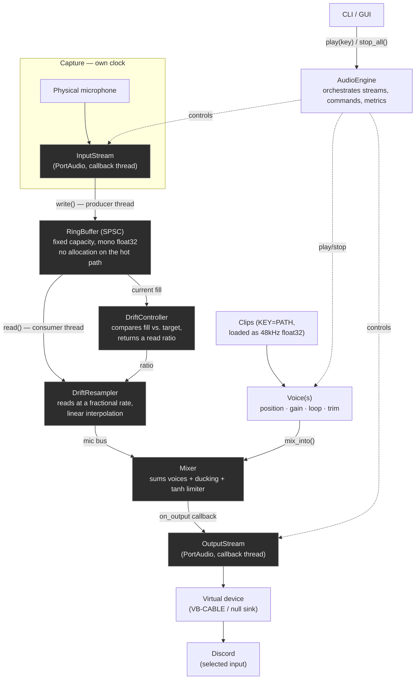

# soundboard

[](https://github.com/subenoeva/soundboard/actions/workflows/ci.yml)
[](https://github.com/subenoeva/soundboard/releases)
[](https://www.python.org/downloads/)
[](LICENSE)

Cross-platform soundboard that mixes audio clips with your real microphone and
writes the result into a virtual input device — so Discord (or any other voice
app) receives both as if they came from a single microphone.

## How it works

Discord can only listen to **one** input device at a time. For it to hear both
your voice and the clips you trigger, something has to mix them *before* they
reach Discord.

No user-space process can create a virtual capture device without a signed
kernel driver, so this application does not create the virtual cable. It relies
on an external one (VB-CABLE on Windows, a PipeWire/PulseAudio null sink on
Linux) and does three things:

1. Captures your physical microphone.
2. Adds the clips you trigger.
3. Writes the result to the virtual device Discord has selected as its input.

## Requirements

- A virtual audio device (see below).
- To run from source: **Python 3.13+** and [`uv`](https://docs.astral.sh/uv/).

### Virtual audio device

| Platform | Setup |
|---|---|
| **Windows** | Install [VB-CABLE](https://vb-audio.com/Cable/) (free) or VoiceMeeter. External installer, one time only. |
| **Linux** | Create a null sink with PipeWire/PulseAudio (see below). |
| **macOS** | Not supported yet — see [Roadmap](#roadmap). |

```bash
pactl load-module module-null-sink sink_name=soundboard_cable
pactl load-module module-remap-source master=soundboard_cable.monitor source_name=soundboard_mic
```

In Discord, select the virtual cable (e.g. `CABLE Input (VB-Audio Virtual Cable)`)
as the input device.

## Installation

### Prebuilt executable

Download the binary for your platform from the
[Releases page](https://github.com/subenoeva/soundboard/releases) —
`soundboard-vX.Y.Z-windows.exe` or `soundboard-vX.Y.Z-linux-x86_64.AppImage`. It ships
preconfigured against the shared sound library, so there is nothing to set up.

Platform caveats:

- **Windows** — VB-CABLE still has to be installed separately; a signed kernel driver
  cannot be bundled. The `.exe` is not code-signed, so SmartScreen will warn about an
  unknown publisher: *More info → Run anyway*.
- **Linux** — the PipeWire/PulseAudio null sink still has to be configured by hand.
  Global hotkeys do not work under Wayland (protocol design, not a bug). Saving the
  session needs a running secret service — make sure `gnome-keyring` or `kwalletd` is
  active. The AppImage bundles Qt and PortAudio but not the X11 and ALSA client
  libraries underneath them, which a desktop install normally already has. On a minimal
  system, Qt fails with *could not load the Qt platform plugin "xcb"*; install them with:

  ```bash
  sudo apt install libasound2t64 libxcb-cursor0 libxcb-icccm4 libxcb-keysyms1 \
      libxcb-xkb1 libxkbcommon-x11-0
  ```

### Updates

The desktop app checks for a newer release on launch and shows a banner when it finds
one. Nothing is downloaded until you press **Actualizar**; once the download is verified
and installed the banner offers **Reiniciar ahora**. There is also a **Buscar
actualizaciones** button in the header for checking on demand, which — unlike the launch
check — tells you when you are already on the latest version.

Every release ships a `SHA256SUMS` manifest and an Ed25519 signature over it
(`SHA256SUMS.sig`). The app verifies that signature against a public key compiled into
the binary, then checks the download against the digest the manifest lists, before
anything is written over the running executable. A download that fails either check is
deleted and never installed. The update is refused rather than escalated if the folder
holding the binary is not writable — move the application somewhere you own, or relaunch
it with the privileges that folder needs.

To verify a download by hand:

```bash
tail -n +2 SHA256SUMS | sha256sum -c    # skip the leading `version vX.Y.Z` line
```

Turn the launch check off by setting `SOUNDBOARD_NO_UPDATE_CHECK=1`, or by adding
`"update_check": false` to `settings.json` (see [Configuration](#configuration)). The
manual button keeps working either way. Builds run from a source checkout or installed
with `pip` never self-update — there is no single file to replace — and hide the button
entirely.

### From source

```bash
git clone https://github.com/subenoeva/soundboard.git
cd soundboard
uv sync
```

`uv sync` installs the runtime dependencies (`numpy`, `sounddevice`, `soundfile`,
`soxr`, `platformdirs`, `supabase`, `keyring`, `PySide6`, `pynput`) and the dev group
(`pytest`, `mypy`, `ruff`) into a local virtualenv (`.venv`).

Verify the installation and find the exact device names to use:

```bash
uv run soundboard devices
```

## Usage

### Desktop app

```bash
uv run soundboard gui   # or just `soundboard` — with no arguments it opens the GUI,
                        # which is what makes double-clicking the packaged binary work
```

On first launch it asks you to sign in (unless a session is already stored) and to pick
a microphone, a virtual cable and a grid size; later launches reuse that configuration
from `<config>/soundboard/ui_layout.json`.

The window shows the account and active devices in the header, the clip grid in the
middle, and an output VU meter plus engine metrics in the footer. From there:

- **Click** a cell to trigger it — it lights up and draws playback progress.
- **Drag and drop** an audio file onto an empty cell to upload it and share it in the
  library.
- **Right-click** a cell to assign a sound someone else already shared, bind a keyboard
  shortcut, pick a cell color, or clear it.
- **Settings** changes microphone, output and grid size without restarting. Shrinking
  the grid discards the cells that fall outside it.
- **Stop all** cuts every voice currently playing.
- Closing the window minimizes to the system tray; **Quit** from the tray icon is what
  actually shuts the audio engine down.

Keyboard shortcuts work even when the window is not focused, except on Linux under
Wayland.

### Command line

```bash
uv run soundboard run --mic "part of the microphone name" --out "CABLE Input" \
  --sound applause=clips/applause.wav \
  --sound airhorn=clips/airhorn.wav
```

| Flag | Meaning |
|---|---|
| `--mic` / `--out` | Case-insensitive substring of the device name — no need for the exact name or the index, which changes with the connected hardware. |
| `--sound KEY=VALUE` | Repeatable. Binds a key to a local audio file, or to an id or name from the shared library. Any format `soundfile` can decode; resampled to 48 kHz mono on load. |
| `--blocksize` | Block size in frames (default 256 ≈ 5.3 ms). Raise to 512/1024 if you hear dropouts. |

With the engine running, type a key and press Enter to play that clip, `stop` to
silence everything, `quit` to exit.

## Shared sound library

The library is shared across users: any authenticated user can add sounds and see all of
them, but can only edit or delete their own. It is backed by Supabase (Postgres + Storage
+ Auth), with Row Level Security enforcing ownership.

### Configuration

Set these environment variables, or add them to `<config>/soundboard/settings.json`
under the `"supabase"` key as `{"url": ..., "anon_key": ...}`:

```bash
export SOUNDBOARD_SUPABASE_URL="https://your-project.supabase.co"
export SOUNDBOARD_SUPABASE_ANON_KEY="your-anon-key"
```

The anon key is public by Supabase design — protection comes from RLS, not from keeping
the key secret.

### Running your own backend

The prebuilt binaries ship pointing at a shared instance. To run your own, create a
Supabase project and apply the migration in `supabase/migrations/`:

```bash
supabase link --project-ref <your-project-ref>
supabase db push
```

That single migration creates everything the app needs: the `profiles`, `categories` and
`sounds` tables, their RLS policies and grants, and the private `sounds` storage bucket
with its access policies. Take the URL and the anon key from *Project Settings → API* and
configure them as above.

Email confirmation is on by default in a fresh Supabase project, so `auth signup` will
not let you log in until the address is confirmed. Turn it off under
*Authentication → Providers → Email* if you would rather skip that step.

### Account

```bash
uv run soundboard auth signup --email you@example.com
uv run soundboard auth login  --email you@example.com
uv run soundboard auth whoami
uv run soundboard auth logout
```

The session is stored in the operating system credential store, so there is no need to
log in on every run.

### Sounds and categories

```bash
uv run soundboard categories add memes
uv run soundboard categories list
uv run soundboard sounds add clips/airhorn.wav --name airhorn --category memes
uv run soundboard sounds list
uv run soundboard sounds list --mine
uv run soundboard sounds edit <id> --gain-db -3 --loop
uv run soundboard sounds rm <id>
```

Library sounds can be triggered from the CLI by id or name:

```bash
uv run soundboard run --mic "..." --out "CABLE Input" --sound applause=<id-or-name>
```

The first playback downloads and caches the sound on disk, keyed by content hash;
later playbacks reuse the local copy.

## Troubleshooting

| Symptom | Cause and fix |
|---|---|
| Crackles, dropouts or glitches in what Discord hears | The block size is too small for the machine. Raise `--blocksize` to 512 or 1024 — higher latency, more headroom. |
| `error: no input device matching '...'` | The substring did not match. Run `soundboard devices` and copy a fragment of the exact name. |
| Discord hears the clips but not your voice (or vice versa) | `--out` is pointing at the wrong endpoint. It must be the cable's *input* side (`CABLE Input`), and Discord must listen to the *output* side. |
| `error: Supabase is not configured` | Neither the environment variables nor `settings.json` are set — see [Configuration](#configuration). |
| `error: no session; run 'soundboard auth login'` | No stored session. Log in once; it persists in the OS credential store. |
| Signup succeeds but login fails | The email is not confirmed yet. Confirm it, or disable email confirmation in your own project. |
| Keyboard shortcuts do nothing on Linux | Wayland does not allow global hotkeys. Use an X11 session, or trigger the clips from the window. |
| Saving the session fails on Linux | No secret service running. Start `gnome-keyring` or `kwalletd`. |
| Windows SmartScreen warns about an unknown publisher | The release binary is not code-signed. *More info → Run anyway*. |

## Architecture

Two independent PortAudio streams (input and output) — each device has its own clock,
with no guarantee they run at the same rate — are bridged by a ring buffer and a drift
correction based on fractional resampling. The resulting microphone bus is mixed with
the active voices and limited before being written to the virtual device.



The shaded nodes run on PortAudio's real-time callback threads: no I/O, no logging, no
`queue.Queue` and no large allocations inside them — vectorized numpy arithmetic only.
`RingBuffer` is the single point of contact between the capture and playback threads,
guarded by a lock that covers the whole operation (the class docstring explains why).

### Packages

| Package | Responsibility |
|---|---|
| `audio/` | Real-time engine: backends, ring buffer, drift correction, voices, mixer, `AudioEngine`. Does no I/O and imports no GUI. |
| `remote/` | Supabase-backed shared library: session/auth, sounds and categories CRUD, PCM resolution for playback. |
| `library/` | Upload import (decode, hash, gain measurement) and the on-disk cache for downloaded PCM. |
| `updater/` | Self-update: signed release manifest, verified download, in-place binary swap. Imports no GUI. |
| `ui/` | Qt Quick desktop GUI — the only package that imports PySide6. |
| `hotkeys.py` | Global keyboard shortcuts behind a `HotkeyManager` protocol; the only module that imports `pynput`. |
| `cli.py` | Subcommands: `devices`, `run`, `auth`, `sounds`, `categories`, `gui`. |

Every layer with a real external dependency sits behind a protocol with an in-memory
double, so the whole suite runs without audio hardware, a display or a network:
`AudioBackend`/`FakeBackend`, `RemoteClient`/`FakeRemoteClient`,
`HotkeyManager`/`FakeHotkeyManager`, `ReleaseFeed`/`FakeReleaseFeed`.

## Development

```bash
uv sync --all-groups
uv run pytest
uv run ruff check .
uv run mypy
```

Three pytest marks are deselected by default and have to be run explicitly:

```bash
uv run pytest -m hardware    # needs a real audio device
uv run pytest -m display     # spawns a real OS-level keyboard hook
uv run pytest -m supabase    # needs `supabase start` first
```

The `supabase` mark covers the RLS integration tests and requires the
[Supabase CLI](https://supabase.com/docs/guides/cli) and Docker. Migrations live in
`supabase/migrations/`.

Releases are automated: [release-please](https://github.com/googleapis/release-please)
computes the next version from Conventional Commits on `master`, and the release
workflow builds the Windows executable and the Linux AppImage with PyInstaller.

## Roadmap

- **Automatic routing** — detect or create the virtual device without manual steps
  (`routing.windows`, `routing.linux`).
- **Effects** — an effects chain over the microphone bus (the `Effect` protocol is
  designed but not implemented).
- **macOS** — support via BlackHole.

Lower priority:

- **Windows installer** — an Inno Setup wizard shipped alongside the portable
  executable, with an uninstaller and an *Apps & features* entry. It would install per
  user under `%LOCALAPPDATA%\Programs\soundboard` rather than into `Program Files`: the
  self-updater replaces the running binary in place, which an unelevated process cannot
  do there, and elevating an automatic update is not a trade worth making. Both
  artefacts would come from the same PyInstaller build and the same signed `SHA256SUMS`.
  It is also the natural place to detect VB-CABLE and offer to install it, which covers
  part of *Automatic routing* above.
- **Download-on-demand installer** — a small stub that fetches the payload during
  installation instead of embedding it. It does not reduce what gets downloaded, only
  when, and it would have to reproduce the updater's Ed25519 verification rather than
  settle for a pinned hash, or it becomes the weak link in a chain that is otherwise
  signed end to end. Worth revisiting only if optional components ever make the payload
  large enough to justify it.

## License

Copyright (C) 2026 subenoeva

This program is free software: you can redistribute it and/or modify it under the terms
of the GNU General Public License as published by the Free Software Foundation, either
version 3 of the License, or (at your option) any later version. It is distributed in the
hope that it will be useful, but WITHOUT ANY WARRANTY; without even the implied warranty
of MERCHANTABILITY or FITNESS FOR A PARTICULAR PURPOSE. See the [LICENSE](LICENSE) file
for the full text.

In practice: forks are welcome, but anything distributed on top of this code has to ship
its source under the same license.
